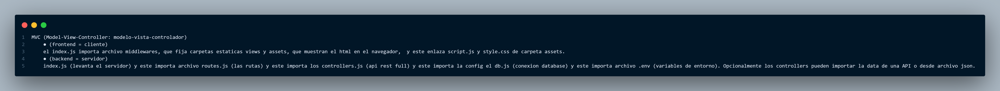
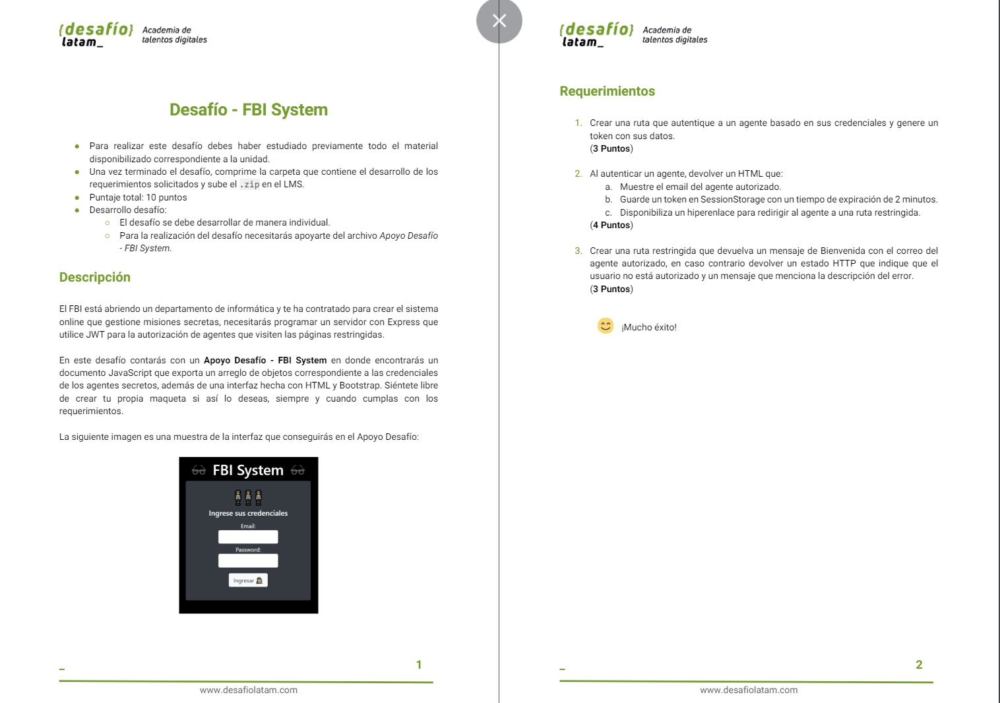

# //--------MODULO 8-PostgreSQL en Node.js Token--------

 
🚀[token](https://m8d32token.onrender.com)
 
# estructura de carpetas => modelo vista controlador (MVC)
//importaciones = 
index <= rutas <= controller <= data
👨🏽‍💻

          

-# Uso de req.params, req.body y req.query en las operaciones CRUD con solicitudes HTTP.
-
-● req.params: Se utiliza en las operaciones Read (GET), Update (PUT) y Delete (DELETE) para capturar los parámetros de la ruta en la URL, generalmente un ID para buscar en la base de datos, API o en un archivo JSON.
-  --ejemplo:
-         //--Read (GET): Para obtener una tarea específica por su ID.//
-                app.get('/tasks/:taskId', function(req, res) {
-                    let taskId = req.params.taskId;
-                    // Buscar la tarea en la base de datos y devolverla
-                });
-● req.body: Se utiliza en las operaciones Create (POST) y Update (PUT) para acceder a los datos enviados en el cuerpo de la solicitud HTTP, generalmente para agregar o actualizar datos en la base de datos, API o en un archivo JSON.
-  --ejemplo:
-          //--Create (POST): Para crear una nueva tarea.//
-                app.post('/tasks', function(req, res) {
-                    let newTask = req.body;
-                    // Agregar la nueva tarea a la base de datos
-                    });
-● req.query: Se utiliza en la operación Read (GET) para leer los parámetros de consulta en la URL, generalmente para filtrar resultados en una base de datos, API o en un archivo JSON.
-  --ejemplo:
-          //--Read (GET): Para obtener tareas que coincidan con un estado específico (por ejemplo, completadas).
-                app.get('/tasks', function(req, res) {
-                    let status = req.query.status;
-                    // Buscar las tareas que coincidan con el estado en la base de datos y devolverlas
-                });

www.desafiolatam.com
  

# Estructura de Directorios de my_project🚀

Este proyecto tiene una estructura organizada en directorios para manejar diferentes aspectos como estilos, scripts, imágenes, bases de datos y vistas. Reutilizable, asegúrate de ajustar los nombres de los archivos y directorios según tu proyecto específico.

Este repositorio contiene los archivos y directorios siguientes:

...

- my_project/
  - ├── assets/
  - │   ├── sounds/
  - │   ├── css/
  - │   │   ├── principal/
  - │   │   ├── animal/
  - │   │   └── pokemon/
  - │   ├── js/
  - │   │   ├── principal/
  - │   │   ├── pokemon/
  - │   │   ├── animal/
  - │   │   └── videos/
  - │   ├── img/
  - │   │   ├── logo.png
  - │   │   └── background.jpg
  - │   └── documents/
  - ├── config/
  - │   ├── db.js
  - │   ├── dbMail.js
  - │   └── dbSend.js
  - ├── controller/
  - │   ├── sendMail.js
  - │   └── userController.js
  - ├── db/
  - │   ├── transferencias.sql
  - │   └── usuarios.sql
  - ├── middlewares/
  - │   └── middlewares.js
  - ├── model/
  - │   ├── transferencias.js
  - │   └── usuarios.js
  - ├── node_modules/
  - ├── queries/
  - │   └── consultas.js
  - ├── routes/
  - │   └── routes.js
  - ├── views/
  - │   |
  - │   ├── layouts/
  - │   │   └── main.hbs
  - │   │   ├── animales.hbs
  - │   │   ├── pokemon.hbs
  - │   │   └── videos.hbs
  - │   └── partials/
  - │       ├── api-hero.hbs
  - │       ├── banco.hbs
  - │       ├── botones-pdf.hbs
  - │       ├── carousel.hbs
  - │       ├── colum-grill.hbs
  - │       ├── footer.hbs
  - │       ├── form-contact.hbs
  - │       ├── grid-card.hbs
  - │       └── menu.hbs
  - ├── .env
  - ├── .gitignore
  - ├── index.js
  - ├── package-lock.json
  - ├── package.json
  - └── README.md

## Descripción de Directorios Principales

- **assets/**: Contiene recursos como archivos de sonido, hojas de estilo CSS, scripts JS, imágenes y documentos.
- **config/**: Configuraciones del proyecto, incluyendo archivos de conexión a la base de datos y de configuración de envío de correos electrónicos.
- **controller/**: Controladores que manejan las solicitudes de la aplicación.
- **db/**: Archivos de base de datos, incluyendo scripts SQL para transferencias y usuarios.
- **middlewares/**: Middlewares para la aplicación.
- **model/**: Modelos de datos para la aplicación.
- **node_modules/**: Módulos de Node.js utilizados en el proyecto.
- **queries/**: Archivos de consultas para la base de datos.
- **routes/**: Rutas de la aplicación.
- **views/**: Vistas de la aplicación, incluyendo páginas, diseños y parciales.

## Otros Archivos y Directorios

- **.env**: Archivo de configuración de variables de entorno.
- **.gitignore**: Archivo para especificar qué archivos y directorios se deben ignorar en Git.
- **index.js**: Archivo principal de la aplicación.
- **package-lock.json**: Archivo de bloqueo de versiones de las dependencias de Node.js.
- **package.json**: Archivo de configuración del proyecto Node.js.
- **README.md**: Este archivo de documentación.

 

